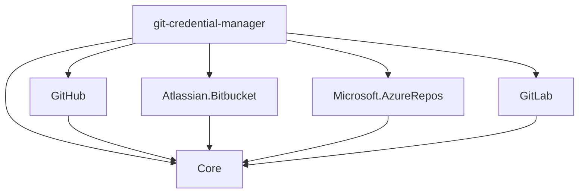
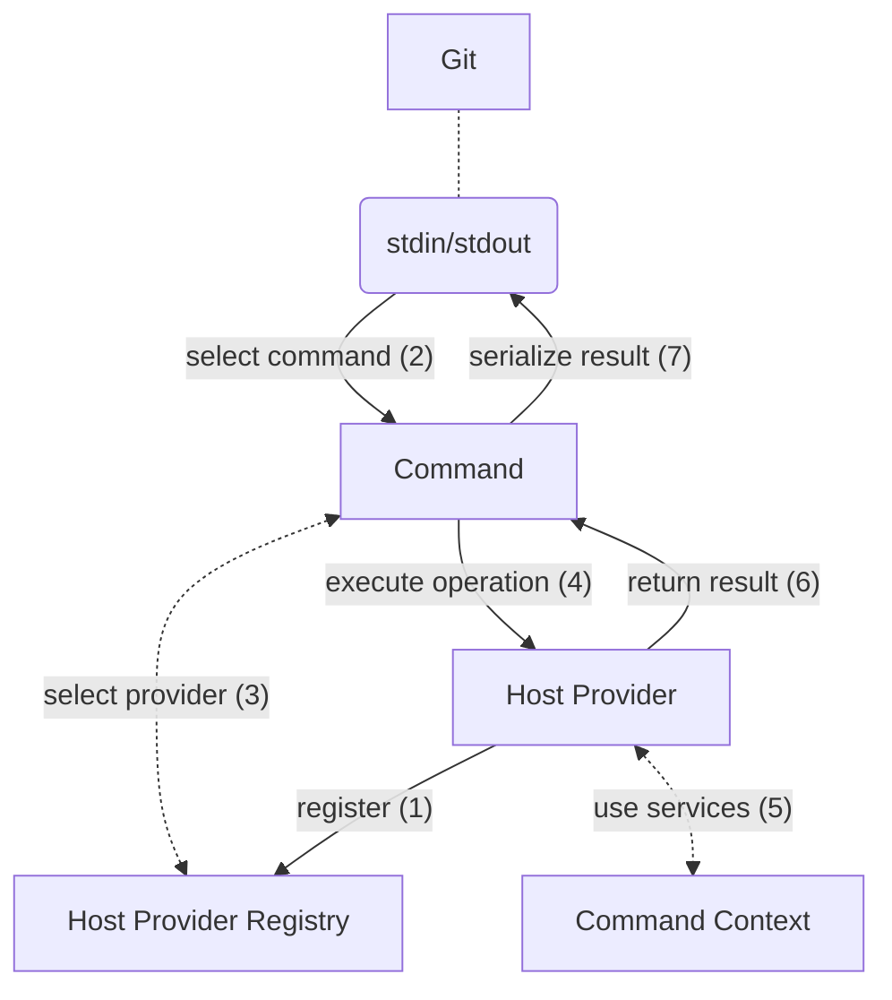

# Architecture

## Overview

Git Credential Manager (GCM) is built to be Git host and platform/OS
agnostic. Shared commands, the Git credential protocol, settings, credential
storage, authentication, console services, and platform abstractions live in
[`src/Core`][core-project]. The product projects target the latest .NET LTS;
they do not target .NET Standard or .NET Framework. The current project graph
is declared in [`git-credential-manager.slnx`][solution].

The entry point is [`src/git-credential-manager/Program.cs`][core-program].
It initializes the main-thread dispatcher, starts an `AppMain` thread, registers
the host providers, and runs the `Application` object from `Core`. This project
emits the `git-credential-manager(.exe)` executable.

GitHub, Bitbucket, Azure Repos, and GitLab have their own projects, each
referencing `Core`. The executable references all four. `GenericHostProvider`
lives in `Core` and provides the fallback for other hosts.

### Cross-platform UI

Graphical prompts use [Avalonia][avalonia] **in process**. Shared controls,
views, view models, and the application main loop live under `src/Core/UI`;
provider-specific UI lives in the corresponding provider project.

The main loop starts lazily, when work is first posted to GCM's dispatcher.
Returning a stored credential does not require starting the UI framework.
See the [main thread dispatcher][gcm-dispatcher] documentation before changing
UI initialization, main-thread work, or shutdown.

Authentication components also retain support for configured out-of-process UI
helpers. These are optional overrides, not a requirement for new providers or
separate UI projects built by this solution. See the
[host provider specification][host-provider-helpers].

### Build and deployment

Shared build properties and artifact paths are declared in
[`Directory.Build.props`][build-props]. Package versions are managed centrally
in [`Directory.Packages.props`][packages-props].

An ordinary solution build produces managed binaries under `out/bin/`.
Platform distribution projects under `build/windows`, `build/macos`, and
`build/linux` publish Native AOT binaries by default. Their publish scripts also
support a trimmed, self-contained non-AOT build. The .NET tool distribution is
different: it publishes portable, framework-dependent IL without AOT or trimming.
See [development and debugging][gcm-development] for commands and prerequisites.

Publishing constraints matter when adding dependencies, reflection, or
serialization. Existing JSON serializers use source-generated contexts so
their metadata is available to the Native AOT and trimming toolchains.

### Microsoft Entra authentication

For authentication using Microsoft accounts or Microsoft Entra ID, things are
a little different. The `EntraAuthentication` component is present in the
`Core` assembly rather than bundled with a specific host provider. This allows
services to share account selection, interactive flows, token caching, and
workload identity support while supplying their own Entra application
configuration.

## Asynchronous programming

GCM makes use of the `async`/`await` model of .NET and C# in almost all
parts of the codebase where appropriate as usually requests end up going to the
network at some point.

Work that must run on the process entry thread - creating UI controls, or
using the macOS identity broker - is marshalled there by the main thread
dispatcher. See the [main thread dispatcher][gcm-dispatcher] documentation for
how that works and the rules for posting to it.

## Command execution

`Application` uses `System.CommandLine` to register the main command called by
Git: `get`, `store`, `erase`, `capability`, along with help/version options,
GCM setup, and provider-specific commands.

GCM maintains a set of known, registered host providers that implement the
`IHostProvider` interface. Providers register themselves by adding an
instance of the provider to the `Application` object via the `RegisterProvider`
method in [`Program`][core-program].
The `GenericHostProvider` is registered last so that it can handle all other
supported remotes as a low-priority catch-all. It supports basic authentication,
[generic OAuth][generic-oauth], and detection of Windows Integrated
Authentication (Kerberos, NTLM, Negotiate) support (1).

For each invocation of GCM, the first argument on the command-line is
matched against the known commands and if there is a successful match, the input
from Git (over standard input) is deserialized and the command is executed (2).

The `get|store|erase` commands parse stdin into a `GitRequest` and scope
settings to its remote URI. They consult the host provider registry for the most
appropriate provider. At each priority, the registry first checks
`IsSupported(GitRequest)` in registration order. If no provider matches, it can
probe an HTTP(S) remote with a HEAD request and check
`IsSupported(HttpResponseMessage)`. Probing is bounded by the configured timeout
and can be disabled; a successful probe is reused across priority levels.
The provider selection can be overridden by the user via the
[`credential.provider`][credential-provider] or [`GCM_PROVIDER`][gcm-provider]
configuration and environment variable respectively (3).

The `get|store|erase` commands call the corresponding
`Get|Store|EraseCredentialAsync` methods on the `IHostProvider`, passing the
`GitRequest` (4). Providers receive `ICommandContext` at construction, rather
than as an argument to each credential operation, and use its services to
complete the request (5).

Once a credential has been created, retrieved, stored or erased, the host
provider returns a `GitResponse` (for `get` operations only) to the calling
command (6). The `get` command serializes the response over stdout, including
capability-gated fields where negotiated with Git (7). A response can also
cancel the credential acquisition pipeline (`quit=1`), yield to another helper
(an empty response), or request another authentication round (`continue=1`).
See the [provider response contract][host-provider-responses].

## Host provider

Host providers implement the `IHostProvider` interface. They can choose to
directly implement the interface they can also derive from the `HostProvider`
abstract class (which itself implements the `IHostProvider` interface).

The `HostProvider` abstract class implements the
`Get|Store|EraseCredentialAsync` methods and instead has the
`GenerateCredentialAsync` abstract method, and the `GetServiceName` virtual
method. Calls to `get`, `store`, or `erase` result in first a call to
`GetServiceName` which should return a stable and unique value for the provider
and request. This value forms part of the attributes associated with any stored
credential in the credential store. During a `get` operation the
credential store is queried for an existing credential with such service name.
If a credential is found it is wrapped in a `GitResponse` and returned
immediately. Similarly, calls to `store` and `erase` automatically store or
remove credentials matching the service name. Methods are implemented as
`virtual` meaning you can always override this behaviour, for example to clear
other custom caches on an `erase` request, without having to reimplement the
lookup/store credential logic.

The default implementation of `GetServiceName` is usually sufficient for most
providers. It returns the computed remote URL (without a trailing slash) from
the input arguments from Git - `<protocol>://<host>[/<path>]` - no username is
included even if present.

Host providers are queried in turn, by priority (then registration order) via
the `IHostProvider.IsSupported(GitRequest)` method and passed the input
received from Git. If the provider recognises the request, for example by a
matching known host name, they can return `true`. If the provider wants to
cancel and abort an authentication request, for example if this is a HTTP (not
HTTPS) request for a known host, they should still return `true` and later
cancel the request.

Host providers can also be queried via the `IHostProvider.IsSupported(HttpResponseMessage)`
method and passed the response message from a HEAD call made to the remote URI.
This is useful for detecting on-premises instances based on header values. GCM
will only query a provider via this method overload if no other provider at the
same registration priority has returned `true` to the `GitRequest` overload.

Depending on the request from Git, one of `GetCredentialAsync` (for `get`
requests), `StoreCredentialAsync` (for `store` requests) or
`EraseCredentialAsync` (for `erase` requests) will be called. The argument
`GitRequest` contains the request information passed over standard input
from Git/the caller; the same as was passed to `IsSupported`.

`GetCredentialAsync` returns `Task<GitResponse>`, not `Task<ICredential>`.
A successful response contains an `ICredential` that Git can use to complete
authentication. The base class's `GenerateCredentialAsync` method still returns
`Task<ICredential>`.

> [!NOTE]
> The credential can also be an instance where both username and password are
> the empty string, to signal to Git it should let cURL use "any auth"
> detection - typically to use Windows Integrated Authentication.

There are no return values for the `store` and `erase` operations as Git ignores
any output or exit codes for these commands. Failures for these operations are
communicated through `ICommandContext.Console`, which writes user-facing
messages to stderr.

## Command context

`ICommandContext` contains numerous services which are useful for
interacting with various platform subsystems, such as the file system or
environment variables. All services on the command context are exposed as
interfaces for ease of testing and portability between different operating
systems and platforms.

Component|Description
-|-
CredentialStore|Stores and retrieves `ICredential` objects through the configured backend, including native OS stores and file-backed implementations. See [credential stores][credential-stores].
Settings|Abstraction over all GCM settings.
Streams|Standard input, output, and error streams connected to the parent process (typically Git). During credential operations, stdin/stdout are reserved for the Git protocol.
Console|User-facing messages on stderr and interactive Spectre.Console prompts on the controlling terminal. Only interactive prompts require a TTY.
SessionManager|Provides information about the current user session.
Trace|Diagnostic tracing. Use secret-aware methods such as `WriteLineSecrets` and `WriteDictionarySecrets` to mask secrets unless secret tracing was explicitly enabled.
FileSystem|Abstraction over file system operations.
HttpClientFactory|Factory for creating `HttpClient` instances that are configured with the correct user agent, headers, and proxy settings.
Git|Provides interactions with Git and Git configuration.
Environment|Abstraction over the current system/user environment variables.
ProcessManager|Creates child processes with the appropriate standard streams, working directory, and Trace2 attribution.

Prefer these abstractions and the shared mocks in `src/TestInfrastructure`
when writing tests. Do not use Git's protocol streams for user-facing prompts
or diagnostics. Authentication components check the interaction, GUI, and
terminal-prompt settings before requesting user input.

## Error handling and tracing

GCM operates a 'fail fast' approach to unrecoverable errors. This usually
means throwing an `Exception` which will propagate up to the entry-point and be
caught, a non-zero exit code returned, and the error message printed with the
"fatal:" prefix. For errors originating from interop/native code, you should
throw an exception of the `InteropException` type. Error messages in exceptions
should be human readable. When there is a known or user-fixable issue,
instructions on how to self-remedy the issue, or links to relevant
documentation should be given.

Warnings can be emitted with `ICommandContext.Console.WriteWarning` when you
want to alert the user to a potential configuration issue that does not
necessarily stop authentication.

The `ITrace` component can be found on the `ICommandContext` object or passed in
directly to some constructors. Verbose and diagnostic information is written
to the trace object in most places of GCM.

Cancellation is distinct from an unrecoverable error. During `get`,
`OperationCanceledException` and terminal interrupts are translated to
`GitResponse.Cancel()`, preventing Git from prompting again. Terminal interrupts
in other commands are handled by `Application` with exit code 130 and no
`fatal:` banner.

[avalonia]: https://avaloniaui.net/
[build-props]: ../Directory.Build.props
[core-program]: ../src/git-credential-manager/Program.cs
[core-project]: ../src/Core
[credential-provider]: configuration.md#credentialprovider
[credential-stores]: credstores.md
[gcm-development]: development.md
[gcm-dispatcher]: dispatcher.md
[gcm-provider]: environment.md#gcm_provider
[generic-oauth]: generic-oauth.md
[host-provider-helpers]: hostprovider.md#3-helpers
[host-provider-responses]: hostprovider.md#23-retrieving-credentials
[packages-props]: ../Directory.Packages.props
[solution]: ../git-credential-manager.slnx
