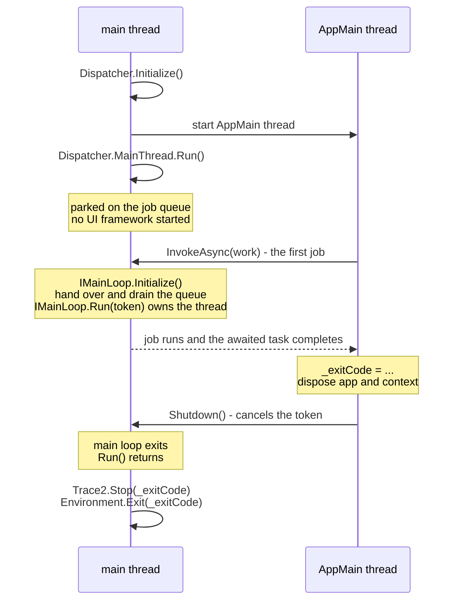
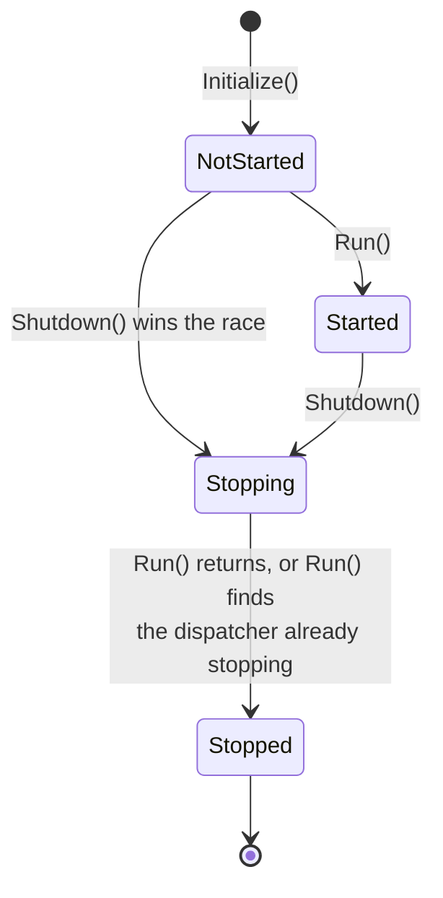
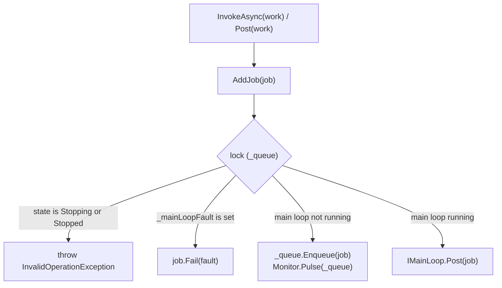
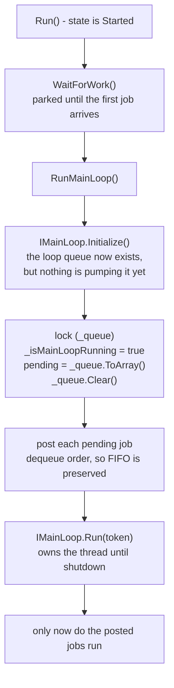

# Main thread dispatcher

## Why it exists

Some platform APIs may only be used from the thread that started the process -
"thread 1", the *main thread*. On macOS this includes creating any UI control.

It also extends somewhere less obvious. MSAL decides **once per process**
whether an `NSApplication` is running, and caches that answer. If one is not
running it requires interactive broker calls to be made on thread 1, and then
takes that thread over with its own polling loop - which cannot coexist with a
UI main loop. If one *is* running it requires neither.

Serving these by simply running GCM on the main thread is not an option:
starting a UI framework costs far more than a typical GCM invocation, and most
invocations never show a window at all. A `get` request served from the
credential store should not pay for a graphical toolkit.

GCM therefore splits the two roles:

- **The main thread** hosts the `Dispatcher` and serves work that must run on
  thread 1.
- **The `AppMain` thread** runs the application itself - command dispatch,
  provider selection, authentication, and everything else.

The dispatcher keeps the main thread parked cheaply until somebody actually
needs it, and only then starts the platform main loop.

## Thread layout

The main loop is started by the *first job posted*, not by an explicit call.
This is deliberate: it makes "work on the main thread implies a running main
loop" true by construction. There is no start-up call for a caller to forget,
and no ordering for a caller to get wrong.

An invocation that posts no jobs never initialises the UI framework at all. The
main thread parks, `Shutdown()` wakes it, and `Run()` returns.

## States

`NotStarted -> Stopping` is a legitimate race, not misuse. `Program.Main` starts
the `AppMain` thread *before* calling `Run()`, so a fast invocation can finish
and shut down first. `Run()` detects this and returns without starting anything.

The distinction between `Stopping` and `Stopped` is what allows that tolerance
without also silently accepting a genuine error. Calling `Run()` once the thread
has been released is a programming error, and throws.

## Data structures

All of these are guarded by the lock taken on `_queue`.

Name|Purpose
-|-
`_queue`|Jobs accepted before the main loop is running. Drained into the main loop at hand-over. Also serves as the monitor for parking and for every state change.
`_outstandingJobs`|Every accepted job, from acceptance until its callback finishes. This is what makes a main loop failure recoverable - see [Failure handling](#failure-handling).
`_isMainLoopRunning`|Whether `AddJob` should post to the main loop rather than enqueue.
`_mainLoopFault`|The first fault seen, if any. Once set, the dispatcher is permanently unusable.
`_state`|See [States](#states).

The main loop has its own separate queue - Avalonia's dispatcher queue - which
the dispatcher can only add to, via `IMainLoop.Post`.

## Posting work

`Dispatcher` exposes one fire-and-forget method and four awaitable ones:

Method|Returns|Completes when
-|-|-
`Post(Action<CT>)`|`void`|n/a - the task is discarded
`InvokeAsync(Action<CT>)`|`Task`|the delegate returns
`InvokeAsync<T>(Func<CT, T>)`|`Task<T>`|the delegate returns
`InvokeAsync(Func<CT, Task>)`|`Task`|the returned task completes
`InvokeAsync<T>(Func<CT, Task<T>>)`|`Task<T>`|the returned task completes

The `CancellationToken` passed to the delegate is signalled at shutdown.

The last two overloads exist because an `async` delegate returns at its first
yielding `await`. Without them `async _ => ...` binds to `Func<CT, T>` with `T`
inferred as `Task<...>`, and the caller gets back a task that completes when the
work *starts* rather than when it finishes. These overloads unwrap the nested
task, so the result always tracks the work to completion.

> **Note**
>
> `Post` discards the task, so a job that throws has nowhere to report the
> failure. Prefer `InvokeAsync` unless the result genuinely does not matter.

Work always *begins* on the main thread. Because the main loop installs its own
synchronization context, continuations after an `await` resume there too, unless
the delegate opts out with `ConfigureAwait(false)`.

### Routing

The three accepting paths also add the job to `_outstandingJobs`. Completing or
posting a job happens *outside* the lock, because both run code that takes other
locks - the main loop's, or the caller's continuation.

## Hand-over

The hand-over is the delicate part. It must not leave a job sitting in a queue
that nobody will ever pump again.

Flipping `_isMainLoopRunning` and draining `_queue` under a single lock closes
the window in which a concurrent `AddJob` could enqueue into a queue that has
already been drained.

&nbsp;|before hand-over|after hand-over
-|-|-
`_queue`|`[j1] [j2] [j3]`|empty
`_outstandingJobs`|`{j1, j2, j3}`|`{j1, j2, j3}` - unchanged
main loop queue|not started|`[j1] [j2] [j3]`

Jobs stay in `_outstandingJobs` across the hand-over. They are removed only once
their callback has actually run.

Note the ordering guarantee this buys. A job cannot run until `IMainLoop.Run` is
pumping, and on macOS that is the point at which `NSApplication` starts. Work
posted to the dispatcher is therefore guaranteed to run with `NSApplication`
already up, so MSAL always sees a GUI application no matter which happens first.

## Failure handling

If the main loop cannot be started, or stops unexpectedly, no main thread work
can ever run. Callers waiting on a job would otherwise wait forever, and GCM
would hang with Git waiting on it.

`FailAllJobs` therefore faults everything in `_outstandingJobs` - which covers
work still in `_queue` *and* work already handed to the main loop - records the
fault, and fails any later arrivals immediately. It is idempotent: the first
fault wins, so concurrent failures report a single, consistent cause.

Two further details matter:

- A callback already sitting in the main loop's queue re-checks `_mainLoopFault`
  before executing, so work never runs after its task has been faulted.
- The dispatcher thread then parks until shutdown rather than propagating. The
  `AppMain` thread still needs to observe its faulted task, unwind, and shut the
  dispatcher down so that the process exits with the right code.

## Shutdown

`Shutdown()` may be called from any thread. It moves to `Stopping`, wakes
anything parked, and cancels the token - outside the lock, since cancellation
runs the main loop's own callbacks. Cancelling is the *only* stop signal the
main loop gets; `IMainLoop` has no separate shutdown method.

**Outstanding work is abandoned, not drained.** Its tasks never complete. This
is deliberate: `Shutdown()` is called only once the application has finished
everything it cares about, so anything still in flight is fire-and-forget by
definition. Waiting for it would hang the common case of a window shown without
anyone awaiting it - there would be nothing left to close the window, and so
nothing to wait for.

## Rules for contributors

- **Anything needing the main thread goes through the dispatcher.** Do not reach
  for the UI framework's own dispatcher directly.
- **Post only what genuinely needs thread 1.** Posting the first job is what
  pays for starting the UI framework. This is why the silent authentication
  paths deliberately stay off the dispatcher - see
  [`EntraAuthentication.PublicClient.cs`][entra-public-client].
- **Do not block the main thread.** A job that blocks stops the loop pumping,
  which stalls every other job, the UI, and any platform work the loop drives.
- **Never wait on a dispatcher task from inside a job.** The continuation needs
  the very loop that the job itself is occupying.
- `CheckAccess()` and `VerifyAccess()` report whether the calling thread is the
  dispatcher thread, which is useful for avoiding a needless round trip.

## Testing

`IMainLoop` is an internal seam with a single production implementation,
`AvaloniaMainLoop`. An internal `Dispatcher.Initialize(IMainLoop)` overload lets
tests substitute a fake, so hand-over, failure, and shutdown behaviour can be
exercised without a real UI framework and without a real thread 1. See
[`DispatcherTests`][dispatcher-tests].

[dispatcher-tests]: ../src/Core.Tests/UI/DispatcherTests.cs
[entra-public-client]: ../src/Core/Authentication/Entra/EntraAuthentication.PublicClient.cs
