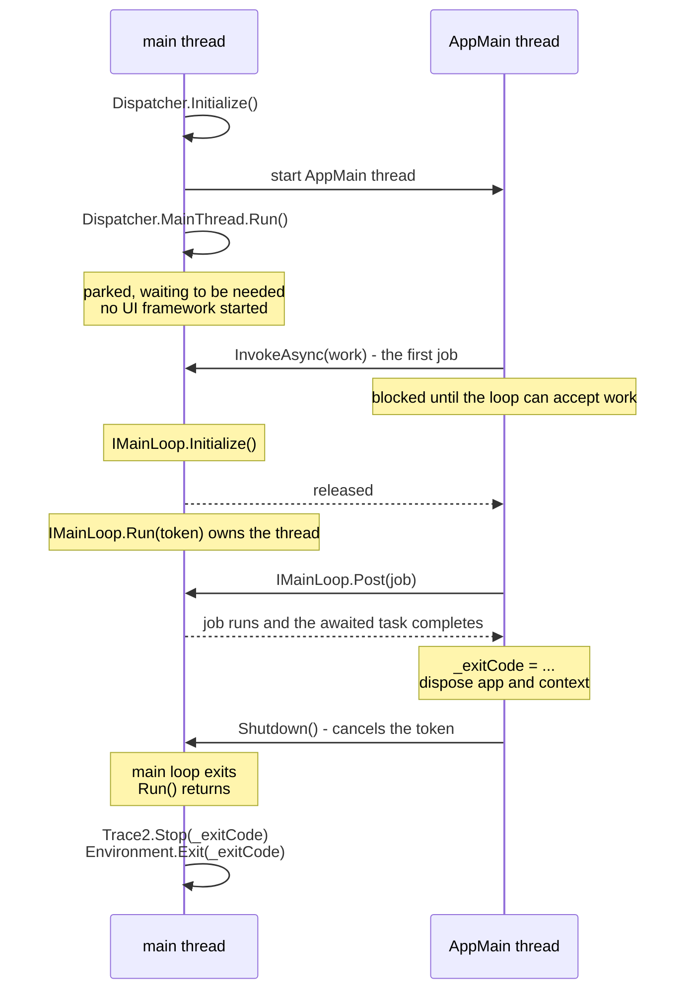
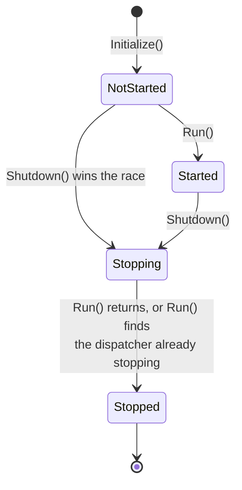
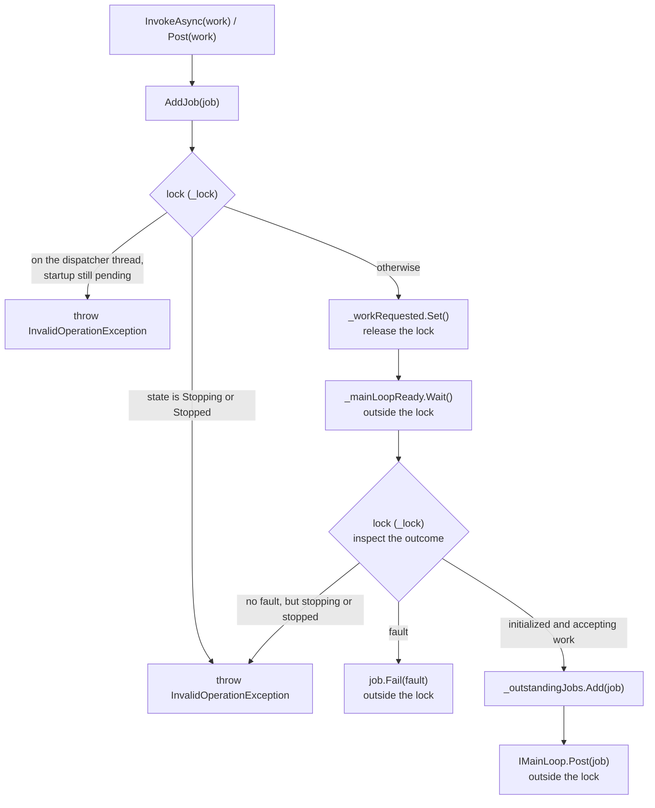
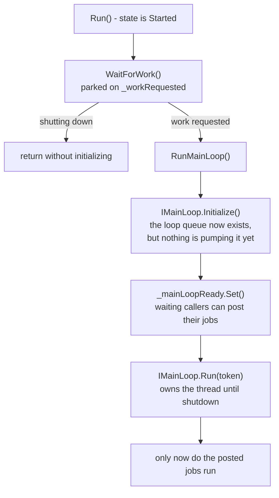

# Main thread dispatcher

## Why it exists

Some platform APIs may only be used from the thread that started the process -
"thread 1", the *main thread*. On macOS this includes creating any UI control.

It also extends somewhere less obvious. MSAL decides **once per process**
whether an `NSApplication` is running, and caches that answer. If one is not
running it requires interactive broker calls to be made on thread 1, and then
takes that thread over with its own polling loop - which cannot coexist with a
UI main loop. If one *is* running it requires neither.

Serving these by simply running GCM on the main thread is not an option:
starting a UI framework costs far more than a typical GCM invocation, and most
invocations never show a window at all. A `get` request served from the
credential store should not pay for a graphical toolkit.

GCM therefore splits the two roles:

- **The main thread** hosts the `Dispatcher` and serves work that must run on
  thread 1.
- **The `AppMain` thread** runs the application itself - command dispatch,
  provider selection, authentication, and everything else.

The dispatcher keeps the main thread parked cheaply until somebody actually
needs it, and only then starts the platform main loop.

## Thread layout

The main loop is started by the *first job posted*, not by an explicit call.
This is deliberate: it makes "work on the main thread implies a running main
loop" true by construction. There is no start-up call for a caller to forget,
and no ordering for a caller to get wrong.

What waits is the *posting*, not the work. A caller that arrives before the
main loop is initialized blocks inside `AddJob` until it can accept work, and
then hands its own job to the loop. The first caller therefore pays the cost of
starting the UI framework - which is reasonable, since it is the one that
asked for the main thread.

An invocation that posts no jobs never initialises the UI framework at all. The
main thread parks, `Shutdown()` wakes it, and `Run()` returns.

## States

`NotStarted -> Stopping` is a legitimate race, not misuse. `Program.Main` starts
the `AppMain` thread *before* calling `Run()`, so a fast invocation can finish
and shut down first. `Run()` detects this and returns without starting anything.

The distinction between `Stopping` and `Stopped` is what allows that tolerance
without also silently accepting a genuine error. Calling `Run()` once the thread
has been released is a programming error, and throws.

## Data structures

`_lock`, a `System.Threading.Lock`, guards the lifecycle state, fault, and
outstanding jobs. Two one-shot `ManualResetEventSlim` gates handle waiting,
always outside that lock:

Name|Purpose
-|-
`_workRequested`|Opened by the first work request or shutdown. Releases the parked dispatcher thread, which checks whether it should initialize the main loop or exit.
`_mainLoopReady`|Opened when initialization succeeds, the main loop fails, or the dispatcher shuts down. Releases callers waiting in `AddJob`, which inspect the outcome under `_lock` before accepting work.
`_outstandingJobs`|Every accepted job, from acceptance until its callback finishes. This is what makes a main loop failure recoverable - see [Failure handling](#failure-handling).
`_mainLoopFault`|The first fault seen, if any. Once set, the dispatcher is permanently unusable.
`_state`|See [States](#states).

Neither gate is ever reset. Signals survive until a thread waits, and every
current or future waiter is released once a gate opens. An open gate is a
reason to inspect the state, not a promise that work can run.

`_workRequested` uses a zero spin count to park the main thread without
spinning while it waits to be needed. `_mainLoopReady` uses the default spin
count, allowing a brief spin before blocking.

The gates have the dispatcher's lifetime, not just `Run()`'s. They are not
disposed by `Shutdown()` or `Run()`, since posting callers can still be waiting
or signalling as those methods return. Neither gate's `WaitHandle` is used, so
their native wait handles are never materialized.

The dispatcher deliberately keeps **no queue of its own**. The only queue is the
main loop's - Avalonia's dispatcher queue - which the dispatcher can add to via
`IMainLoop.Post`. A job therefore never sits anywhere that nothing is pumping.

## Posting work

`Dispatcher` exposes one fire-and-forget method and four awaitable ones:

Method|Returns|Completes when
-|-|-
`Post(Action<CT>)`|`void`|n/a - the task is discarded
`InvokeAsync(Action<CT>)`|`Task`|the delegate returns
`InvokeAsync<T>(Func<CT, T>)`|`Task<T>`|the delegate returns
`InvokeAsync(Func<CT, Task>)`|`Task`|the returned task completes
`InvokeAsync<T>(Func<CT, Task<T>>)`|`Task<T>`|the returned task completes

The `CancellationToken` passed to the delegate is signalled at shutdown.

The last two overloads exist because an `async` delegate returns at its first
yielding `await`. Without them `async _ => ...` binds to `Func<CT, T>` with `T`
inferred as `Task<...>`, and the caller gets back a task that completes when the
work *starts* rather than when it finishes. These overloads unwrap the nested
task, so the result always tracks the work to completion.

> **Note**
>
> `Post` discards the task, so a job that throws has nowhere to report the
> failure. Prefer `InvokeAsync` unless the result genuinely does not matter.
> It is also not quite fire-and-forget: like every method here it blocks until
> the main loop can accept work, and only the *work* is unobserved.

Work always *begins* on the main thread. Because the main loop installs its own
synchronization context, continuations after an `await` resume there too, unless
the delegate opts out with `ConfigureAwait(false)`.

### Routing

Opening `_workRequested` requests initialization. Waiting on
`_mainLoopReady` lets each caller inspect the outcome under `_lock`: fault
the job, reject shutdown, or accept it into `_outstandingJobs`. A caller that
has already passed the initial lifecycle check observes a recorded fault even
if shutdown follows it; without a fault, it must re-check the lifecycle before
accepting work.

Failing or posting a job happens *outside* the lock, because both run code that
takes other locks - the main loop's, or the caller's continuation. Gate waits
also happen outside the lock: waiting on an event does not release a held lock.

The second rejection above is the one worth knowing about. Posting from the
dispatcher thread itself while initialization is pending would block the only
thread that could ever release it, so it is rejected rather than left to
deadlock. Once initialization succeeds the dispatcher thread may post freely.

## Starting the main loop

Every job is handed to the main loop by the caller that wanted it, which is why
callers wait for the loop rather than leaving work for the dispatcher thread to
forward. Posting on the caller's own stack keeps the job's [context](#context)
attached to it, and it means there is never a moment where accepted work is
sitting somewhere that nothing pumps.

On the successful path, `_mainLoopReady` is set only once
`IMainLoop.Initialize` has returned. No job can *run* until `IMainLoop.Run` is
pumping - which on macOS is the point at which `NSApplication` starts. Work
posted to the dispatcher is therefore guaranteed to run with `NSApplication`
already up, so MSAL always sees a GUI application no matter which happens first.

## Context

A job runs on the main thread but conceptually belongs to the caller, and the
two want opposite things from the ambient state.

- **Execution context.** The caller's is captured when the job is created and
  restored around the work, so anything flowed by `AsyncLocal<T>` - such as
  `Activity.Current` - is still there inside the job.
- **Trace2 context.** Deliberately the other way round. Trace2 records the
  thread work *ran on*, so the dispatcher's own context is applied on top of the
  restored one, and the caller is recorded as a `dispatcher`/`caller` data event
  so the link back is not lost.

The Trace2 switch has to happen *inside* the restored execution context:
restoring replaces the whole `AsyncLocal<T>` map, so a switch made around it
would simply be shadowed. For the same reason the dispatcher captures its own
Trace2 context when it is constructed rather than reading it when a job runs -
by then the caller's context is in place and would be the one observed.

## Failure handling

If the main loop cannot be started, or stops unexpectedly, no main thread work
can ever run. Callers waiting on a job would otherwise wait forever, and GCM
would hang with Git waiting on it.

`FailAllJobs` therefore faults everything in `_outstandingJobs`, records the
fault, and fails any later arrivals immediately. It is idempotent: the first
fault wins, so concurrent failures report a single, consistent cause.

Three further details matter:

- Publishing `_mainLoopFault` and opening `_mainLoopReady` releases callers
  blocked in `AddJob`. They see the fault instead of the loop they were waiting
  for, so a loop that fails to start cannot strand them. The gate stays open so
  later arrivals also see the fault without waiting.
- A callback already sitting in the main loop's queue re-checks `_mainLoopFault`
  before executing, so work never runs after its task has been faulted.
- The dispatcher thread then parks until shutdown rather than propagating. The
  `AppMain` thread still needs to observe its faulted task, unwind, and shut the
  dispatcher down so that the process exits with the right code. Only this
  failure-path wait materializes `_cts.Token.WaitHandle`, and it returns
  immediately if shutdown already cancelled the token.

## Shutdown

`Shutdown()` may be called from any thread. It moves to `Stopping` and opens
both gates, releasing the parked dispatcher thread and any callers waiting to
post. Callers check the outcome rather than treating the signal as successful
initialization. It then cancels the token, outside the lock since cancellation
runs the main loop's own callbacks. Cancelling is the *only* stop signal the
main loop gets; `IMainLoop` has no separate shutdown method.

**Outstanding work is abandoned, not drained.** Its tasks never complete. This
is deliberate: `Shutdown()` is called only once the application has finished
everything it cares about, so anything still in flight is fire-and-forget by
definition. Waiting for it would hang the common case of a window shown without
anyone awaiting it - there would be nothing left to close the window, and so
nothing to wait for.

## Rules for contributors

- **Anything needing the main thread goes through the dispatcher.** Do not reach
  for the UI framework's own dispatcher directly.
- **Post only what genuinely needs thread 1.** Posting the first job is what
  pays for starting the UI framework. This is why the silent authentication
  paths deliberately stay off the dispatcher - see
  [`EntraAuthentication.PublicClient.cs`][entra-public-client].
- **Expect the first post to block.** Starting the main loop happens on the
  posting caller's time. Do not post the first job from anywhere that cannot
  afford to wait for a UI framework to initialise.
- **Do not block the main thread.** A job that blocks stops the loop pumping,
  which stalls every other job, the UI, and any platform work the loop drives.
- **Never wait on a dispatcher task from inside a job.** The continuation needs
  the very loop that the job itself is occupying.
- `CheckAccess()` and `VerifyAccess()` report whether the calling thread is the
  dispatcher thread, which is useful for avoiding a needless round trip. Before
  the main loop is initialized such a round trip is not merely wasteful but
  rejected, since the dispatcher thread would be waiting on itself.

## Testing

`IMainLoop` is an internal seam with a single production implementation,
`AvaloniaMainLoop`. An internal `Dispatcher.Initialize(IMainLoop)` overload lets
tests substitute a fake, so start-up, failure, and shutdown behaviour can be
exercised without a real UI framework and without a real thread 1. The fake can
also hold `Initialize` or `Run` open on demand, which is what makes the
rendezvous between a posting caller and the starting main loop testable. Tests
cover signals preceding waits, concurrent posters, and shutdown while
initialization is still blocked, whether it later succeeds or fails. See
[`DispatcherTests`][dispatcher-tests].

[dispatcher-tests]: ../src/Core.Tests/UI/DispatcherTests.cs
[entra-public-client]: ../src/Core/Authentication/Entra/EntraAuthentication.PublicClient.cs
