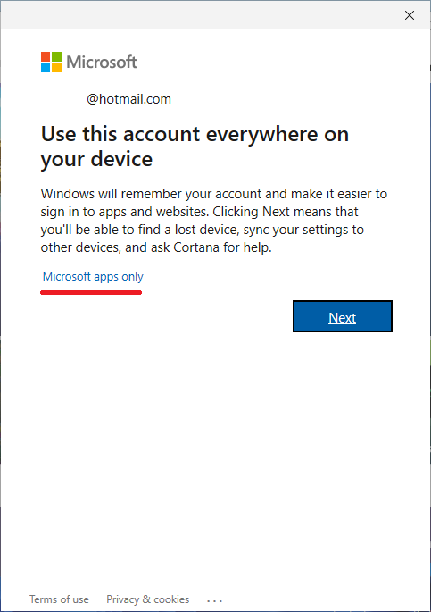
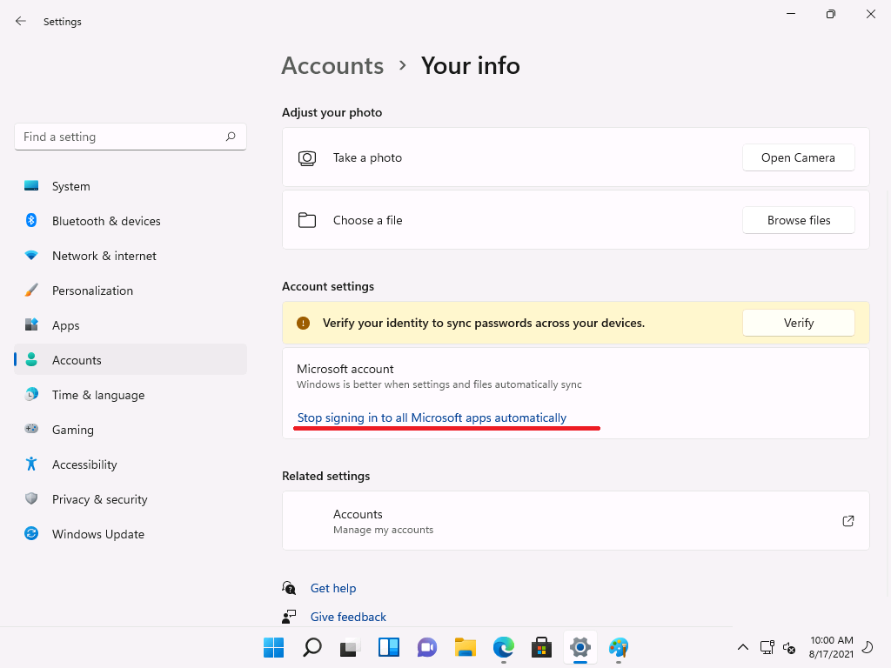

# Web Account Manager integration

Git Credential Manager (GCM) Core knows how to integrate with the [Web Account Manager (WAM)](https://docs.microsoft.com/azure/active-directory/devices/concept-primary-refresh-token#key-terminology-and-components) feature of Windows for authentication of applications.
Authentication requests are said to be "brokered" to the operating system.

Organizations all over the world use [Conditional access policies (CA)](https://docs.microsoft.com/en-us/azure/active-directory/conditional-access/overview) to protect their assets and the source code is a key asset for software businesses, with such policy IT-department can guarantee that a device that accesses to the source code has the latest security patches, anti-virus software and enabled encryption of hard drives.

Currently, WAM is the only product on Windows that can reliably, securely, and silently satisfy those policy, and avoid a user interruption. Also, WAM shares credentials with other applications on the device, like Outlook, Teams etc., and if the user passed multi-factor authentication during Windows Logon, Outlook, or Teams, it will be remembered and GIT, Visual Studio, and the Azure CLI will not require pass multi-factor authentication again. Other implementation GCM will not reliably work with CA policy and has degrade prompt expirience.

While integration with the WAM comes with benefits, it also has some experience changes that you should be aware of.

Note that this currently implemented only in [Azure DevOps](https://dev.azure.com).
It doesn't change authentication with GitHub, Bitbucket, or any other Git host at this moment.


## How to enable

You can opt-in to WAM support by setting the environment variable [`GCM_MSAUTH_USEBROKER`](https://github.com/microsoft/Git-Credential-Manager-Core/blob/main/docs/environment.md#gcm_msauth_usebroker-experimental) or setting the Git configuration value [`credential.msauthUseBroker`](https://github.com/microsoft/Git-Credential-Manager-Core/blob/main/docs/configuration.md#credentialmsauthusebroker-experimental).

## Features

When you turn on WAM support, GCM Core can cooperate with Windows and with other WAM-enabled software on your machine, like Office, OneDrive, Teams, and many other applications on your device. This means a more seamless experience, fewer multi-factor authentication prompts, and the ability to use additional authentication technologies like smart cards and Windows Hello. Additionally, the users will not occasionally or permanently block from source code, if the IT-department enabled CA policies 

These convenience and security features make a good case for enabling WAM.

## Experience changes

The WAM and Windows identity systems are complex, addressing a very broad range of customer use cases.
Integrating with WAM, we inherit some of experience choices made by WAM owners, therefore, we want you to be aware of some defaults and experiences.

Note the GCM Core team does not responsible for the user experience in WAM.

### For work or school accounts (Azure AD-backend identities)
When you sign into an Azure DevOps organization backed by Azure AD (often your company or school email), if your machine is already joined to Azure AD matching that Azure DevOps organization, you'll get a seamless and easy-to-use experience.

More than 80% of Azure AD users on Windows use joined devices, and expected to have a seamless and easy-to-use state. However, if your machine isn't Azure AD-joined, or Azure AD-joined to a different tenant, WAM will present you with the following dialog box:


Depending on what you click, one of three things can happen:

- If you leave "allow my organization to manage my device" checked and click "OK", your computer will be registered with the Azure AD tenant backing the organization. Your identity will also be available to other apps on the computer for signing in, some of which may do so automatically. The device may also be MDM-enrolled ("MDM" means mobile device management - a set of tools that allows an IT administrator to control the state of the device, e.g. AirWatch, MobileIron, Intune, etc.), meaning an administrator can deploy policies to your machine: requiring certain kinds of sign-in, turning on antivirus and firewall software, and enabling BitLocker.<br/>

 <br/>

**Note** Microsoft does not control policies that IT department deploys on your device using MDM provider, Microsoft just provide tools for IT administrators to manage health of IT environment, all question about content of the MDM policies should be addressed to IT department of your organization.

- If you uncheck "allow my organization to manage my device" and click "OK", your computer will be registered with Azure AD, but will not be enrolled in the mobile device management provider. Your identity will be available to other apps on the computer for signing in. 
Other apps may log you in automatically, but if accessing some resource, including source code, requires the device to be managed by MDM, you will be rejected from access and prompted with remediation instructions.

- If you instead click "No, sign in to this app only", your machine will not be Azure AD joined or enrolled in MDM, so no policies can be enforced, and your identity won't be made available to other apps on the computer. In this case, you might be able to access the source code, if IT-department or your organization doesn't require device to be managed or compliant by MDM to access to resources, but it is also possible that you will be rejected from access.

**Note** both CA policies, that used to control safety of resouces, and MDM policies, that deployed on your device, in full control of your IT-department, please, work with them on right balance.

#### Removing device management
If you've allowed your computer to be managed and want to undo it, you can go into **Settings**, **Accounts**, **Access work or school**.
In the section where you see your email address and organization name, click **Disconnect**.


### For Microsoft accounts
When you sign into an Azure DevOps organization backed by Microsoft account (MSA) identities (email addresses like `@outlook.com` or `@gmail.com` fall into this category), you may be prompted to select an existing "work or school account" or use a different one.

In order to sign in with an MSA you should continue and select "Use a different [work or school] account", but enter your MSA credentials when prompted.
This is due to a configuration outside of our control.
We expect this experience to improve over time and a "personal account" option to be presented in the future.


If you've connected your MSA to Windows or signed-in to other Microsoft applications such as Office, then you may see this account listed in the authentication prompts when using GCM.
For any connected MSA, you can control whether or not the account is available to other Microsoft applications in **Settings**, **Accounts**, **Emails & accounts**:


Two very important things to note:
* If you haven't connected any Microsoft accounts to Windows before, the first account you connect will ask the local Windows user account to be converted to a connected account. You can avoid this by clicking "Microsoft apps only" link.

* If you got in this state, you can change it in Settings/Your info by choosing "Stop signing in to all Microsoft apps automatically".


## Running as administrator

The Windows broker ("WAM") makes heavy use of [COM](https://docs.microsoft.com/en-us/windows/win32/com/the-component-object-model), a remote procedure call (RPC) technology built into Windows.
In order to integrate with WAM, Git Credential Manager and the underlying [Microsoft Authentication Library (MSAL)](https://aka.ms/msal-net) must use COM interfaces and RPCs.
When you run Git Credential Manager as an elevated process, some of the calls made between GCM and WAM may fail due to differing process security levels.
This can happen when you run `git` from an Administrator command-prompt or perform Git operations from Visual Studio running as Administrator.

If you've enabled using the broker, GCM will check whether it's running in an
elevated process.
If it is, GCM will automatically attempt to modify the COM security settings for the running process so that GCM and WAM can work together.
However, this automatic process security change is not guaranteed to succeed.
Various external factors like registry or system-wide COM settings may cause it to fail.
If GCM can't modify the process's COM security settings, GCM prints a warning message and won't be able to use the broker.

```text
warning: broker initialization failed
Failed to set COM process security to allow Windows broker from an elevated process (0x80010119).
See https://aka.ms/gcmcore-wamadmin for more information.
```

### Possible solutions

In order to fix the problem, there are a few options:

1. Run Git or Git Credential Manager from non-elevated processes.
2. Disable the broker by setting the
   [`GCM_MSAUTH_USEBROKER`](environment.md#gcm_msauth_usebroker)
   environment variable or the
   [`credential.msauthUseBroker`](configuration.md#credentialmsauthusebroker)
   Git configuration setting to `false`.
